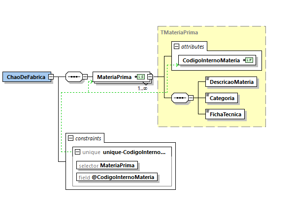

# User Story 1010_2 - Especificação de um documento XSD que valide o conteúdo XML das matérias-primas

## Área - (0) Geral.

### XML Schema

[Qualidade Original](https://bitbucket.org/1181056/lei_isep_2019_20_sem4_2di_1170894_1180871_1181053_1181056_1180/src/master/documentation/USER STORIES/diagrams/1010/1010_2_schema.PNG)

