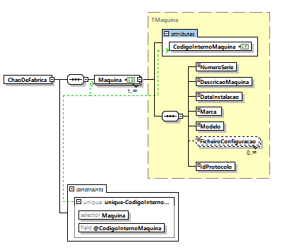

# User Story 1010_3 - Especificação de um documento XSD que valide o conteúdo XML das máquinas

## Área - (0) Geral.

### XML Schema




[Qualidade Original](https://bitbucket.org/1181056/lei_isep_2019_20_sem4_2di_1170894_1180871_1181053_1181056_1180/src/master/documentation/USER STORIES/diagrams/1010/1010_3_schema.PNG)


### Regras de integridade e de estrutura de elementos

#### Elementos:

- DataInstalacao

```xml
<xs:simpleType name="Data">
	<xs:restriction base="xs:int">
		<xs:pattern value="([1-9][0-9]{3})(0[0-9]|1[0-2])([0-2][0-9]|3[0-1])"/>
	</xs:restriction>
</xs:simpleType>
```