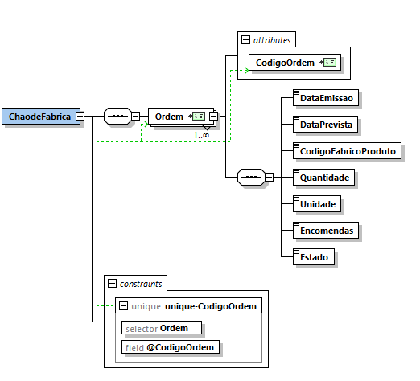

# User Story 1010_6 - Especificação de um documento XSD que valide o conteúdo XML das ordens de produção

## Área - (0) Geral.

### XML Schema


[Qualidade Original](https://bitbucket.org/1181056/lei_isep_2019_20_sem4_2di_1170894_1180871_1181053_1181056_1180/src/master/documentation/USER STORIES/diagrams/1010/1010_6_schema.PNG)


### Regras de integridade e de estrutura de elementos

#### Elementos:

- DataEmissao e DataPrevista

```xml
<xs:simpleType name="Data">
		<xs:restriction base="xs:int">
			<xs:pattern value="([1-9][0-9]{3})(0[0-9]|1[0-2])([0-2][0-9]|3[0-1])"/>
		</xs:restriction>
	</xs:simpleType>
```


- Quantidade

```xml
<xs:simpleType name="Quantidade">
	<xs:restriction base="xs:int">
		<xs:minInclusive value="1"/>
	</xs:restriction>
</xs:simpleType>
```


- Encomenda

```xml
<xs:simpleType name="Encomenda">
		<xs:restriction base="xs:string">
			<xs:pattern value="EC[1-9][0-9]{3}[/][0-9]{5}([,]EC[1-9][0-9]{3}[/][0-9]{5})*"/>
		</xs:restriction>
	</xs:simpleType>
```


- Estado

```xml
<xs:simpleType name="Estado">
		<xs:restriction base="xs:string">
			<xs:pattern value="pendente|Em Execucao|Execucao Parada Temporariamente|Concluida|Suspensa"/>
		</xs:restriction>
	</xs:simpleType>
```

