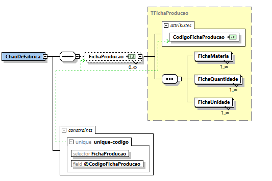

# User Story 1010_7 - Especificação de um documento XSD que valide o conteúdo XML das fichas de produção

## Área - (0) Geral.

### XML Schema

[Qualidade Original](https://bitbucket.org/1181056/lei_isep_2019_20_sem4_2di_1170894_1180871_1181053_1181056_1180/src/master/documentation/USER STORIES/diagrams/1010/1010_7_schema.PNG)


### Regras de integridade e de estrutura de elementos

#### Elementos:

- CodigoFichaProducao

```xml
<xsd:simpleType name="TCodigoFichaProducao">
	<xsd:restriction base="xsd:string">
		<xsd:pattern value="[0-9]+"/>
	</xsd:restriction>
</xsd:simpleType>
```

- FichaMateria

```xml
<xsd:simpleType name="TFichaMateria">
	<xsd:restriction base="xsd:string">
		<xsd:pattern value="[1-9][0-9]{3}([,][1-9][0-9]{3})*"/>
	</xsd:restriction>
</xsd:simpleType>
```

- FichaQuantidade

```xml
<xsd:simpleType name="TFichaQuantidade">
	<xsd:restriction base="xsd:string">
		<xsd:pattern value="[1-9][0-9]{1,6}([,][1-9][0-9]{1,6})*"/>
	</xsd:restriction>
</xsd:simpleType>
```