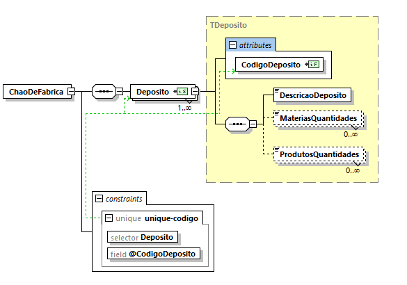

# User Story 1010_8 - Especificação de um documento XSD que valide o conteúdo XML dos depósito

## Área - (0) Geral.

### XML Schema

[Qualidade Original](https://bitbucket.org/1181056/lei_isep_2019_20_sem4_2di_1170894_1180871_1181053_1181056_1180/src/master/documentation/USER STORIES/diagrams/1010/1010_8_schema.PNG)


### Regras de integridade e de estrutura de elementos

#### Elementos:

- CodigoDeposito

```xml
<xsd:simpleType name="TCodigo">
            <xsd:restriction base="xsd:string">
                <xsd:pattern value="[0-9]+" />
            </xsd:restriction>
    </xsd:simpleType>
```

- DescricaoDeposito

```xml
<xsd:simpleType name="TDescricao">
    <xsd:restriction base="xsd:string">
        <xsd:pattern value="[A-Za-z ]+" />
    </xsd:restriction>
</xsd:simpleType>
```

- MateriasQuantidades

```xml
<xsd:simpleType name="TMateriasQuantidades">
        <xsd:restriction base="xsd:string">
            <xsd:pattern value="[1-9][0-9]*-[0-9]+.[0-9]+([;][1-9][0-9]*-[0-9]+.[0-9]+)*"/>
        </xsd:restriction>
    </xsd:simpleType>
```

- ProdutosQuantidades

```xml
<xsd:simpleType name="TProdutosQuantidades">
        <xsd:restriction base="xsd:string">
            <xsd:pattern value="[1-9][0-9]*-[0-9]+.[0-9]+([;][1-9][0-9]*-[0-9]+.[0-9]+)*"/>
        </xsd:restriction>
    </xsd:simpleType>
```

