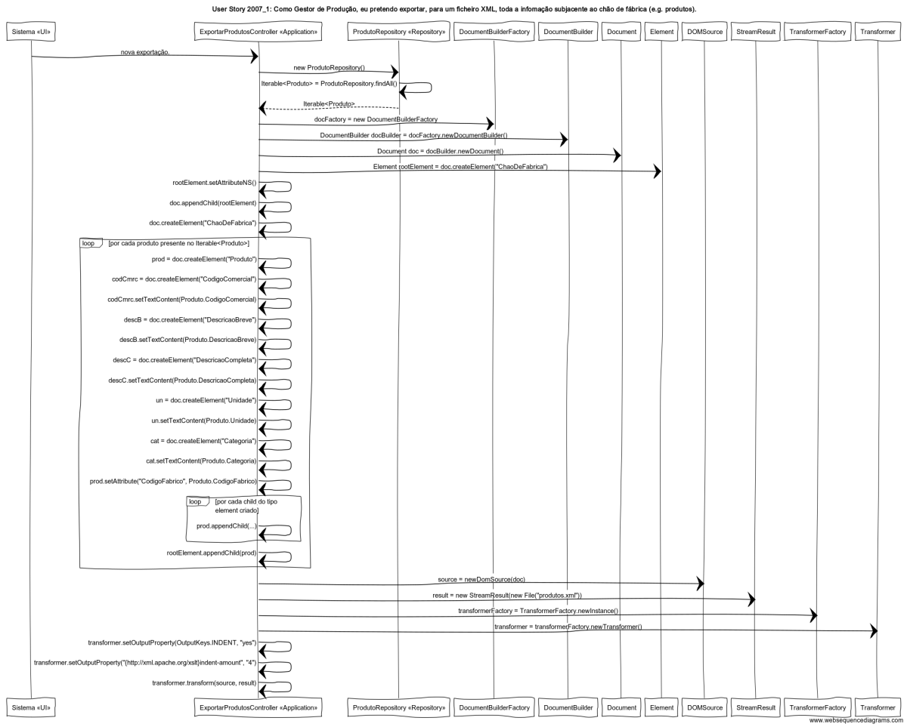

# User Story 2007_1 - Exportar para um ficheiro XML toda informação dos produtos

## Área - (1) Produção.

### Conceitos de Implementação

| O quê                     | Ação                                                         | Onde                      | Método                                                       |
| ------------------------- | ------------------------------------------------------------ | ------------------------- | ------------------------------------------------------------ |
| Sistema «UI»              | nova exportação                                              | n/a                       | n/a                                                          |
|                           | O sistema informa o Gestor de Produção do sucesso da operação. | n/a                       | n/a                                                          |
| ExportarProdutoController | nova instância da base de dados dos produtos                 | package Application       | new ProdutoRepository()                                      |
|                           | nova instância da classe DocumentBuilderFactory              | package javax.xml.parsers | new DocumentBuilderFactory()                                 |
|                           | nova instância da classe DocumentBuilder                     | package javax.xml.parsers | new DocumentBuilder()                                        |
|                           | nova instância da classe Document                            | package javax.xml.parsers | new Document()                                               |
|                           | nova instância da classe Element                             | package org.w3c.dom       | createElement()                                              |
|                           | definição do XSD schema                                      | package org.w3c.dom       | setAttriibuteNS()                                            |
|                           | criacao de um elemento Produto                               | package Application       | createElement("Produto")                                     |
|                           | criacao dos elementos dentro do Produto                      | package Application       | createElement()                                              |
|                           | introducao do conteúdo do elemento                           | package Application       | setTextContent()                                             |
|                           | definicao de um atributo                                     | package Application       | setAttribute()                                               |
|                           | criar elemento raiz                                          | package Application       | createElement("ChaoDeFabrica")                               |
|                           | efetuar a ligacao entre o Produto e os seus elementos filho  | package Application       | appendChild(Produto)                                         |
|                           | nova instancia da classe DOMSource                           | package Application       | newDomSource()                                               |
|                           | nova instancia da classe StreamResult para a criacao do novo ficheiro .xml | package Application       | new StreamResult(new File("produtos.xml"))                   |
|                           | Transformacao do formato do resultado no .xml                | package Application       | TransformerFactory.newInstance(),  transformerFactory.newTransformer(), setOutputProperty(OutputKeys.INDENT, "yes"), setOutputProperty("{http://xml.apache.org/xslt}indent-amount", "4"), transform(source, result) |
| Document                  | definir o elemento raiz como filho                           | package javax.xml.parsers | appendChild()                                                |
| ProdutoRepository         | Iterable com todos os produtos presentes no sistema          | package Repository        | ProdutoRepository.finAll()                                   |

## Diagrama de Sequências

[Qualidade original](https://bitbucket.org/1181056/lei_isep_2019_20_sem4_2di_1170894_1180871_1181053_1181056_1180/src/master/documentation/USER%20STORIES/diagrams/2007/2007_1_SD.png)