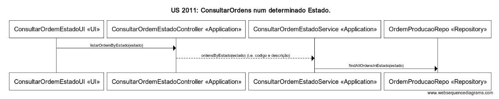

# User Story 2011 - Consultar Ordens de Produção num determinado estado

# Área - (1) Produção

### Conceitos de Implementação

| O quê                             | Ação                                                      | Onde        | Método                                                       |
| --------------------------------- | --------------------------------------------------------- | ----------- | ------------------------------------------------------------ |
| ConsultarOrdemEstadoUI         | lista todas as Ordens de Produção num determinado estado   | UI          | listarOrdemByEstado(estado) na classe ConsultarOrdemEstadoController na package Application |
| ConsultarOrdemEstadoController | devolve todas as Ordens de Produção num dado estado | Application | ordensByEstado(estado) na classe ConsultarOrdemEstadoService na package Application |
| ConsultarOrdemEstadoService    | devolve todas as Ordens de Produção num dado estado | Application | findAllOrdensWithEstado(estado) na classe OrdemProducaoRepo na package Repository |
| OrdemProducaoRepo                 | n/a                                                       | Repository  | n/a                                                          |

### Diagrama de Sequências

[Qualidade Original](https://bitbucket.org/1181056/lei_isep_2019_20_sem4_2di_1170894_1180871_1181053_1181056_1180/src/master/documentation/USER%20STORIES/diagrams/2011/2011_SD.png)
