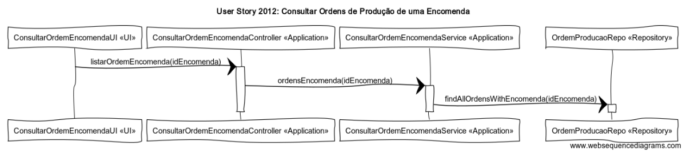

# User Story 2012 - Consultar Ordens de Produção de uma Encomenda

# Área - (1) Produção

### Conceitos de Implementação

| O quê                             | Ação                                                      | Onde        | Método                                                       |
| --------------------------------- | --------------------------------------------------------- | ----------- | ------------------------------------------------------------ |
| ConsultarOrdemEncomendaUI         | lista todas as Ordens de Produção de uma dada Encomenda   | UI          | listarOrdemEncomenda(idEncomenda) na classe ConsultarOrdemEncomendaController na package Application |
| ConsultarOrdemEncomendaController | devolve todas as Ordens de Produção de uma dada Encomenda | Application | ordensEncomenda(idEncomenda) na classe ConsultarOrdemEncomendaService na package Application |
| ConsultarOrdemEncomendaService    | devolve todas as Ordens de Produção de uma dada Encomenda | Application | findAllOrdensWithEncomenda(idEncomenda) na classe OrdemProducaoRepo na package Repository |
| OrdemProducaoRepo                 | n/a                                                       | Repository  | n/a                                                          |

### Diagrama de Sequências

[Qualidade Original](https://bitbucket.org/1181056/lei_isep_2019_20_sem4_2di_1170894_1180871_1181053_1181056_1180/src/master/documentation/USER%20STORIES/diagrams/2012/2012_SD.png)