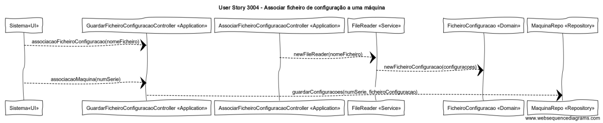

# User Story 3004 - Associar ficheiro de configuração a uma máquina.

# Área - (2) Chão de Fábrica

### Conceitos de Implementação

| O quê                                 | Ação                                                         | Onde        | Método                                                       |
| ------------------------------------- | ------------------------------------------------------------ | ----------- | ------------------------------------------------------------ |
| Sistema                               | armazena o conteúdo do ficheiro apresentado em memória       | UI          | associacaoFicheiroConfiguracao(nomeFicheiro) na classe GuardarFicheiroConfiguracaoController na package Application |
| -                                     | armazena o conteúdo do ficheiro que já está em memória na base de dados a máquina | -           | associacaoMaquina(numSerie) na classe GuardarFicheiroConfiguracaoController na package Application |
| AssociarFicheiroConfiguracaoController | lê a informação que se encontra dentro do ficheiro indicado  | Application | newFileReader(nomeFicheiro) na classe FileReader             |
| -                                     | armazena o conteúdo lido na base de dados a máquina          | -           | guardarConfiguracoes(numSerie, ficheiroConfiguracao) na classe MaquinaRepo na package Repository |
| FileReader                            | armazena o conteúdo lido em memória                          | Service     | newFicheiroConfiguracao(configuracoes) na classe FicheiroConfiguracao na package Domain |
| FicheiroConfiguracao                  | n/a                                                          | Domain      | n/a                                                          |
| MaquinaRepo                           | n/a                                                          | Repository  | n/a                                                          |

### Diagrama de Sequências

[Qualidade Original](https://bitbucket.org/1181056/lei_isep_2019_20_sem4_2di_1170894_1180871_1181053_1181056_1180/src/master/documentation/USER STORIES/diagrams/3004/3004_SD.png)