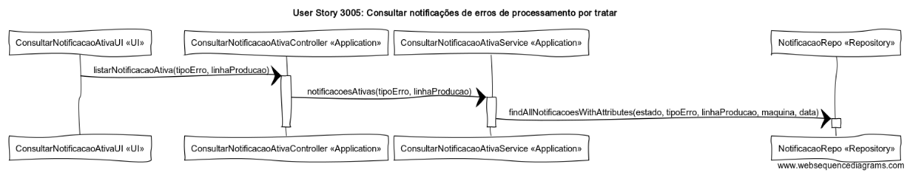

# User Story 3005- Consultar notificações de erros de processamento por tratar

# Área - (2) Chão de Fábrica

### Conceitos de Implementação

| O quê                               | Ação                                                         | Onde        | Método                                                       |
| ----------------------------------- | ------------------------------------------------------------ | ----------- | ------------------------------------------------------------ |
| ConsultarNotificacaoAtivaUI         | lista as notificações de erro de processamento ativas com os filtros aplicados (tipo de erro, linha de produção geradora) | UI          | listarNotificacaoAtiva(tipoErro, linhaProducao) na classe ConsultarNotificacaoAtivaController na package Application |
| ConsultarNotificacaoAtivaController | devolve as notificações de erro de processamento ativas com os filtros aplicados (tipo de erro, linha de produção geradora) | Application | notificacoesAtivas(tipoErro, linhProducao) na classe ConsultaNotificacaoAtivaService na package Application |
| ConsultaNotificacaoAtivaService     | encontra na base de dados as notificações de erro de processamento ativas com os filtros aplicados (estado, tipo de erro, linha de produção geradora, maquina geradora, data do erro) | Application | finaAllNotificacoesWithAttributes(estado, tipoErro, linhaProducao, maquina, data) na classe NotificacaoRepo na package Repository |
| NotificacaoRepo                     | n/a                                                          | Repository  | n/a                                                          |

### Diagrama de Sequências

[Qualidade Original](https://bitbucket.org/1181056/lei_isep_2019_20_sem4_2di_1170894_1180871_1181053_1181056_1180/src/master/documentation/USER%20STORIES/diagrams/3005/3005_SD.png)