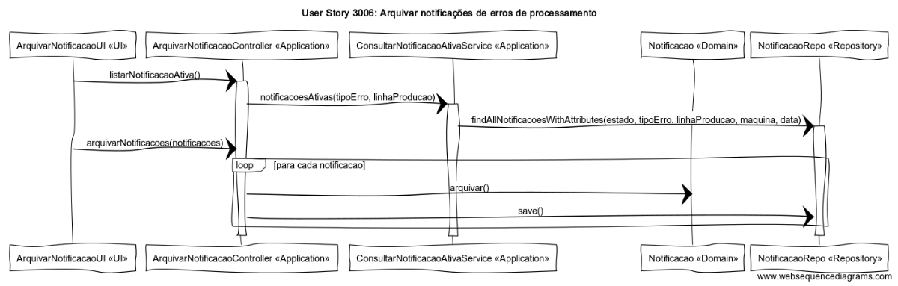

# User Story 3006 - Arquivar notificações de erros de processamento

# Área - (2) Chão de Fábrica

### Conceitos de Implementação

| O quê                            | Ação                                                         | Onde        | Método                                                       |
| -------------------------------- | ------------------------------------------------------------ | ----------- | ------------------------------------------------------------ |
| ArquivarNotificacaoUI            | lista todas as notificações de erro de processamento com o estado "ativa" sem filtros | UI          | listarNotificacaoAtiva() na classe ArquivarNotificacaoController na package Application |
| -                                | muda o estado das notificações dadas para "arquivado"        | -           | arquivarNotificacoes(notificacoes) na classe ArquivarNotificacaoController na package Application |
| ArquivarNotificacaoController    | devolve as notificações ativas na base de dados com o tipo de erro e linha de produção dados | Application | notificacoesAtivas(tipoErro, linhaProducao) na classe ConsultarNotificacaoAtivaService na package Application |
| -                                | muda o estado da notificação de erro de processamento para "arquivada" | -           | arquivar() na classe Notificacao na package Domain           |
| -                                | guarda a notificacao de erro de processamento atualizada na base de dados | -           | save() na classe NotificacaoRepo na package Repository       |
| ConsultarNotificacaoAtivaService | encontra todas as notificações de erro de processamento com o estado, tipo de erro, linha de produção geradora, máquina geradora e data dados | Application | findAllNotificacoesWithAttributes(estado, tipoErro, linhaProducao, maquina, data) na classe NotificacaoRepo na package Repository |
| Notificacao                      | n/a                                                          | Domain      | n/a                                                          |
| NotificacaoRepo                  | n/a                                                          | Repository  | n/a                                                          |

### Diagrama de Sequências

[Qualidade Original](https://bitbucket.org/1181056/lei_isep_2019_20_sem4_2di_1170894_1180871_1181053_1181056_1180/src/master/documentation/USER%20STORIES/diagrams/3006/3006_SD.png)