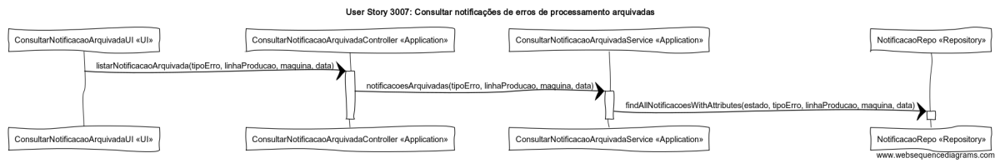

# User Story 3007- Consultar notificações de erros de processamento arquivadas

# Área - (2) Chão de Fábrica

### Conceitos de Implementação

| O quê                                   | Ação                                                         | Onde        | Método                                                       |
| --------------------------------------- | ------------------------------------------------------------ | ----------- | ------------------------------------------------------------ |
| ConsultarNotificacaoArquivadaUI         | lista as notificações  com o estado "arquivada" e o tipo de erro, linha de produção, máquina e data dados | UI          | listarNotificacaoArquivada(tipoErro, linhaProducao, maquina, data) na classe ConsultarNotificacaoArquivadaController na package Application |
| ConsultarNotificacaoArquivadaController | devolve as notificações  com o estado "arquivada" e o tipo de erro, linha de produção, máquina e data dados | Application | notificacoesArquivadas(tipoErro, linhaProducao, maquina, data) na classe ConsultarNotificacaoArquivadaService na package «Application» |
| ConsultarNotificacaoArquivadaService    | encontra as notificações  com o estado, o tipo de erro, linha de produção, máquina e data dados | Application | findAllNotificacoesWithAtributes(estado, tipoErro, linhaProducao, maquina, data) na classe NotificacaoRepo na package Repository |
| NotificacaoRepo                         | n/a                                                          | Repository  | n/a                                                          |

### Diagrama de Sequências

[Qualidade Original](https://bitbucket.org/1181056/lei_isep_2019_20_sem4_2di_1170894_1180871_1181053_1181056_1180/src/master/documentation/USER%20STORIES/diagrams/3007/3007_SD.png)