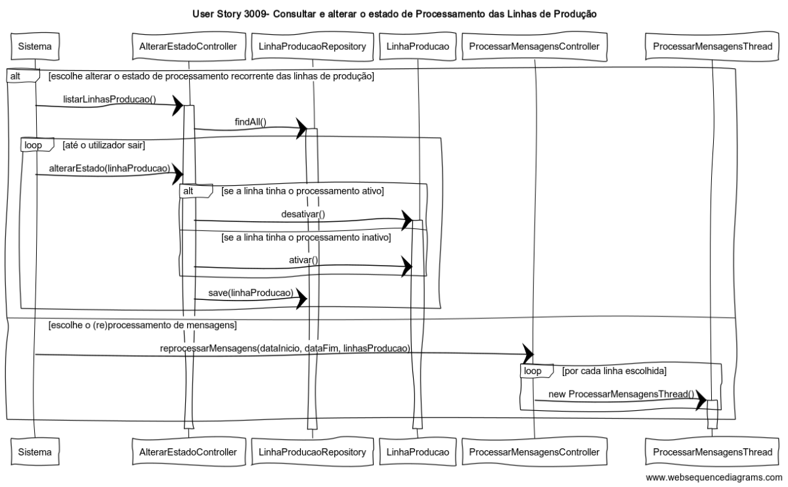

# User Story 3009- Consultar e alterar o estado de Processamento das Linhas de Produção

# Área - (2) Chão de Fábrica

### Conceitos de Implementação

| O quê                        | Ação                                                         | Onde        | Método                                                       |
| ---------------------------- | ------------------------------------------------------------ | ----------- | ------------------------------------------------------------ |
| AlterarEstadoController      | devolve uma lista com todas as linhas de produção            | Application | listarLinhasProducao() na própria classe                     |
| -                            | altera o estado da linha de produção dada para inativo/ativo no caso deste estar ativo/inativo, respetivamente | -           | alterarEstado(linhaProducao) na própria classe               |
| ProcessarMensagensController | processa todas as mensagens pertencentes ao intervalo de tempo e linhas de produção dadas, independentemente do seu estado de processamento | Application | reprocessarMensagens(dataInicio, dataFim, linhasProducao) na própria classe |
| ProcessarMensagensThread     | cria uma instância da classe de processamento de mensagens   | Application | ProcessarMensagensThread() na própria classe                 |
| LinhaProducaoRepository      | devolve todas as linhas de produção no repositório           | Repository  | findAll() na própria classe                                  |
| -                            | guarda a linha de produção dada no repositório, ou atualiza se já existia | -           | save(linhaProducao) na própria classe                        |
| LinhaProducao                | altera o estado de processamento recorrente da linha para inativo | Domain      | desativar() na própria classe                                |
| -                            | altera o estado de processamento recorrente da linha para ativo | -           | ativar() na própria classe                                   |

### Diagrama de Sequências

[Qualidade Original](https://bitbucket.org/1181056/lei_isep_2019_20_sem4_2di_1170894_1180871_1181053_1181056_1180/src/master/documentation/USER%20STORIES/diagrams/3009/3009_SD.png)