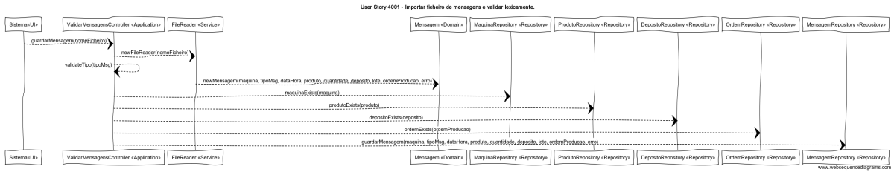

# User Story 4001 - Importar ficheiro de mensagens e validar lexicamente.

## Área - (3) Comunicação.

### Conceitos de Implementação

| O quê                                 | Ação                                                         | Onde        | Método                                                       |
| ------------------------------------- | ------------------------------------------------------------ | ----------- | ------------------------------------------------------------ |
| Sistema                               | importa a informação do ficheiro e armazena o conteúdo na base de dados | UI          | guardarMensagem(nomeFicheiro) na classe ValidarMensagensController na package Application |
| ValidarMensagensController | lê a informação que se encontra dentro do ficheiro indicado  | Application | newFileReader(nomeFicheiro) na classe FileReader             |
| -                          | validar que a Maquina existe                                 | -           | maquinaExists(maquina) na classe MaquinaRepository na package Repository |
| -                          | validar que o Produto existe                                 | -           | produtoExists(produto) na classe ProdutoRepository na package Repository |
| -                          | validar que o Deposito existe                                | -           | depositoExists(deposito) na classe DepositoRepository na package Repository |
| -                          | validar que o Deposito existe                                | -           | ordemExists(ordemProducao) na classe DepositoRepository na package Repository |
| -                          | armazena o conteúdo lido na base de dados da mensagem        | -           | guardarMensagem() na classe MensagemRepository na package Repository |
| FileReader                 | armazena o conteúdo lido em memória                          | Service     | newMensagem(maquina, tipoMsg, dataHora, produto, quantidade, deposito, lote, ordemProducao, erro) na classe Mensagem na package Domain |
| Mensagem                   | n/a                                                          | Domain      | n/a                                                          |
| MaquinaRepository          | n/a                                                          | Repository  | n/a                                                          |
| ProdutoRepository          | n/a                                                          | Repository  | n/a                                                          |
| DepositoRepository         | n/a                                                          | Repository  | n/a                                                          |
| OrdemRepository            | n/a                                                          | Repository  | n/a                                                          |
| MensagemRepository         | n/a                                                          | Repository  | n/a                                                          |

### Diagrama de Sequências

[Qualidade Original](https://bitbucket.org/1181056/lei_isep_2019_20_sem4_2di_1170894_1180871_1181053_1181056_1180/src/master/documentation/USER STORIES/diagrams/4001/4001_SD.png)