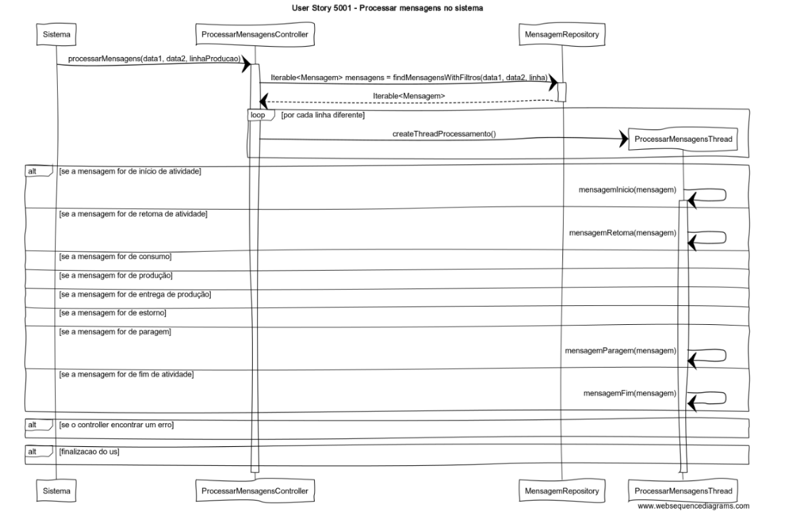
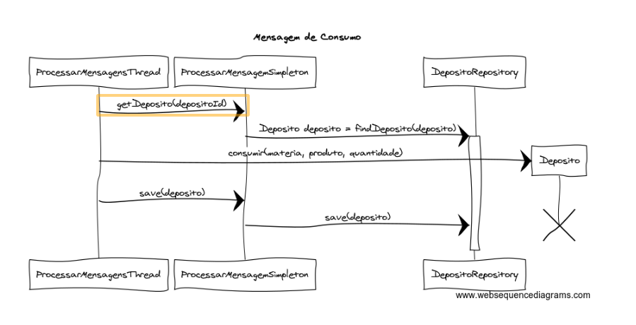
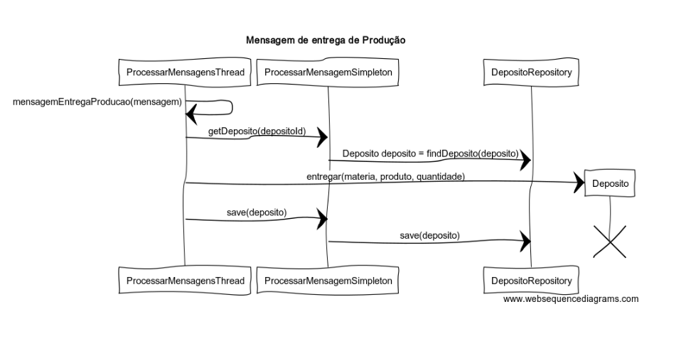
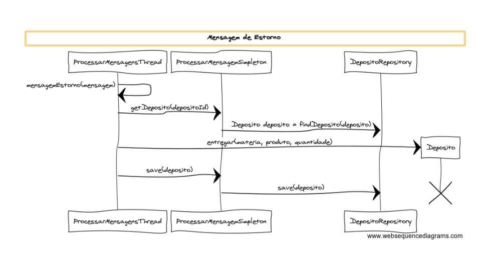
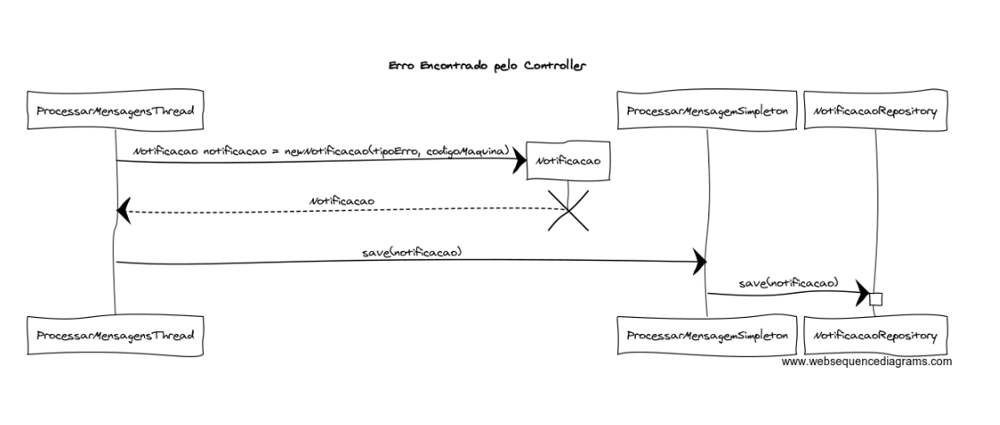

# User Story 5001- Processar mensagens no sistema

# Área - (2) Chão de Fábrica

### Conceitos de Implementação

| ConsultarNotificacaoArquivadaUI         | lista as notificações  com o estado "arquivada" e o tipo de erro, linha de produção, máquina e data dados | UI          | listarNotificacaoArquivada(tipoErro, linhaProducao, maquina, data) na classe ConsultarNotificacaoArquivadaController na package Application |
| ConsultarNotificacaoArquivadaController | devolve as notificações  com o estado "arquivada" e o tipo de erro, linha de produção, máquina e data dados | Application | notificacoesArquivadas(tipoErro, linhaProducao, maquina, data) na classe ConsultarNotificacaoArquivadaService na package «Application» |
| ConsultarNotificacaoArquivadaService    | encontra as notificações  com o estado, o tipo de erro, linha de produção, máquina e data dados | Application | findAllNotificacoesWithAtributes(estado, tipoErro, linhaProducao, maquina, data) na classe NotificacaoRepo na package Repository |
| NotificacaoRepo                         | n/a                                                          | Repository  | n/a                                                          |

| O quê                                   | Ação                                                         | Onde        | Método                                                       |
| --------------------------------------- | ------------------------------------------------------------ | ----------- | ------------------------------------------------------------ |
| ProcessarMensagensController | processa todas as mensagens lidas pelo sistema de processamento de mensagens | Application | findMensagensWithFiltros(data1, data2, linha) na classe  ProcessarMensagensController |
| ProcessarMensagensThread | cria uma thread para cada linha diferente existente no sistema  | Application | createThreadProcessamento() na classe ProcessarMensagensThread |
|  | processa mensagem de inicio de atividade | Application | mensagemInicio(mensagem) na classe ProcessarMensagensThread |
|  | processa mensagem de retoma de atividade | Application | mensagemRetoma(mensagem) na classe ProcessarMensagensThread |
|  | processa mensagem de retoma de consumo | Application | mensagemConsumo(mensagem) na classe ProcessarMensagensThread |
|  | processa mensagem de paragem | Application | mensagemParagem(mensagem) na classe ProcessarMensagensThread |
|  | processa mensagem de fim de atividade | Application | mensagemFim(mensagem) na classe ProcessarMensagensThread |
|  | processa mensagem de producao | Application | mensagemProducao(mensagem) na classe ProcessarMensagensThread |
|  | processa mensagem de entrega de producao | Application | mensagemEntregaProducao(mensagem) na classe ProcessarMensagensThread |
|  | processa mensagem de retoma de estorno | Application | mensagemEstorno(mensagem) na classe ProcessarMensagensThread |
| ProcessarMensagemSimpleton | Application | vai procurar o deposito do qual foi requesitado materia prima | getDeposito(depositoId) na classe ProcessarMensagemSimpleton |
|  | guarda o deposito com as quantidade de materia primas atualizadas | Application | save(deposito) na classe ProcessarMensagemSimpleton |
|  | vai procurar o lote no qual vai ser guardado o resultado da producao | Application | getLote(loteId) na classe ProcessarMensagemSimpleton |
|  | guarda o lote com as quantdades atualizadas | Application | save(lote) na classe ProcessarMensagemSimpleton |
|  | guarda a notificcao de erro criada | Application | save(notificacao) na classe ProcessarMensagemSimpleton |
|  | guarda o consumo total apos o processamento de todas as mensagens | Application | save(consumo) na classe ProcessarMensagemSimpleton |
|  | guarda o estorno total apos o processamento de todas as mensagens | Application | save(estorno) na classe ProcessarMensagemSimpleton |
|  | guarda o desvio total apos o processamento de todas as mensagens | Application | save(desvio) na classe ProcessarMensagemSimpleton |
|  | guarda o tempo de producao total apos o processamento de todas as mensagens | Application | save(tempoProducao) na classe ProcessarMensagemSimpleton |
| MensagemRepository | vai procurar todas as mensagens criadas por uma linha num determinada espaco de tempo | Repository | findMensagensWithFiltros(data1, data2, linha) na classe MensagemRepository |
| Deposito | entrega materia prima a uma maquina | Domain | consumir(materia, produto, quantidade) na classe Deposito |
|  | entrega o produto finalizado | Domain | entregar(materia, produto, quantidade) na classe Deposito |
| DepositoRepository | procura um deposito | Repository | findDeposito(deposito) na classe DepositoRepository |
|  | guarda o estado atual de um deposito | Repository | save(deposito) na classe DepositoRepository |
| Lote | adiciona o produto criado a um lote | Domain | save(lote) na classe Lote |
| LoteRepository | procura um lote | Repository | findLote(lote) na classe LoteRepository |
|  | guarda o estado atual de um lote| Repository | save(lote) na classe LoteRepository |
| Notificacao | cria uma notificacao | Domain | Notificacao(tipoErro, codigoMaquina) na classe Notificacao |
| NotificacaoRepository | guarda uma notificacao | Repository | save(notificacao) na classe NotificacaoRepository |
| Consumo | cria o consumo total resultado do processamento de mensagens | Domain | createConsumo() na classe Consumo |
| ConsumoRepository | guarda o consumo criado no processamento de mensagens | Repository | save(consumo) na classe ConsumoRepository |
| Estorno | cria o estorno total resultado do processamento de mensagens | Domain | createEstorno() na classe Estorno |
| EstornoRepository | guarda o estorno criado no processamento de mensagens | Repository | save(estorno) na classe EstornoRepository |
| Desvio | cria o desvio total resultado do processamento de mensagens | Domain | createDesvio() na classe Desvio |
| DesvioRepository | guarda o desvio criado no processamento de mensagens | Repository | save(desvio) na classe DesvioRepository |
| TempoProducao | cria o tempo de producao total resultado do processamento de mensagens | Domain | createTempoProducao() na classe TempoProducao |
| TempoProducaoRepository | guarda o tempo de producao criado no processamento de mensagens | Repository | save(tempoProducao) na classe TempoProducaoRepository |

### Diagrama de Sequências

